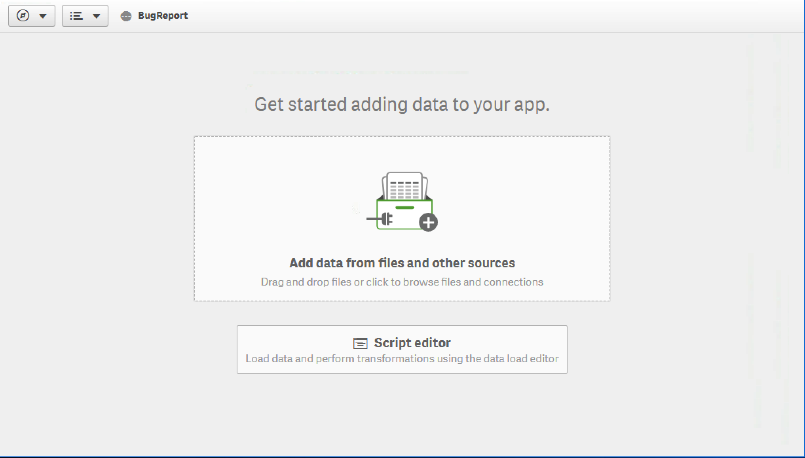
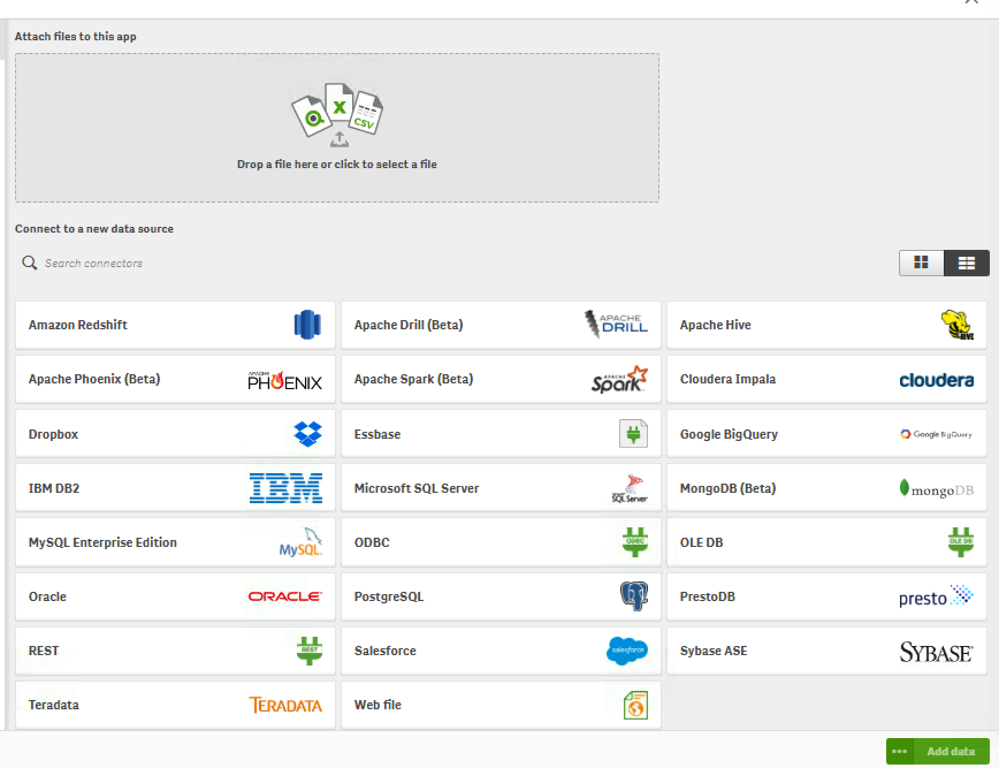
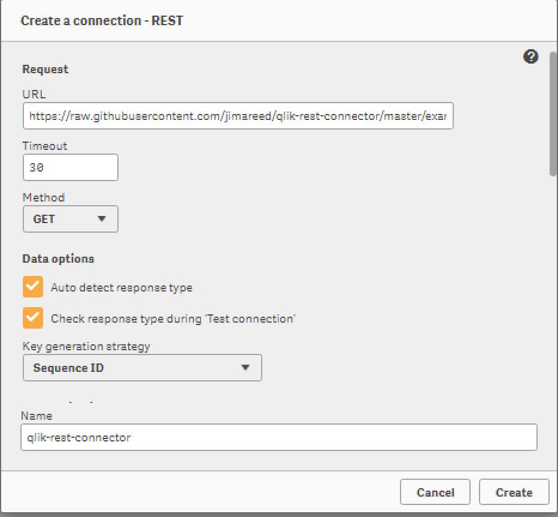
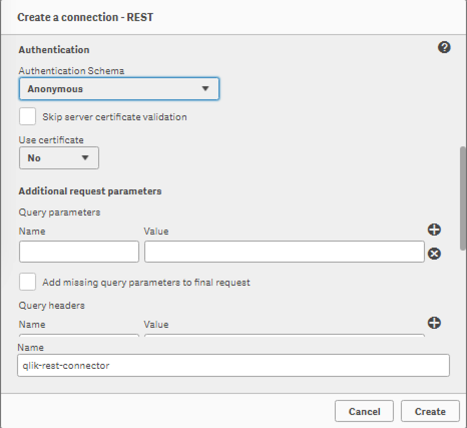
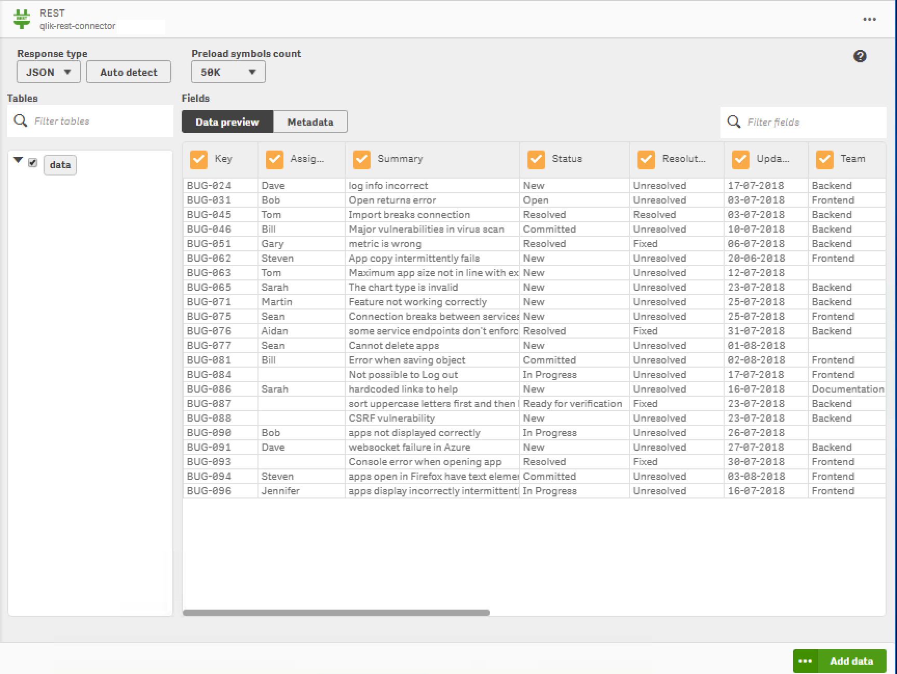
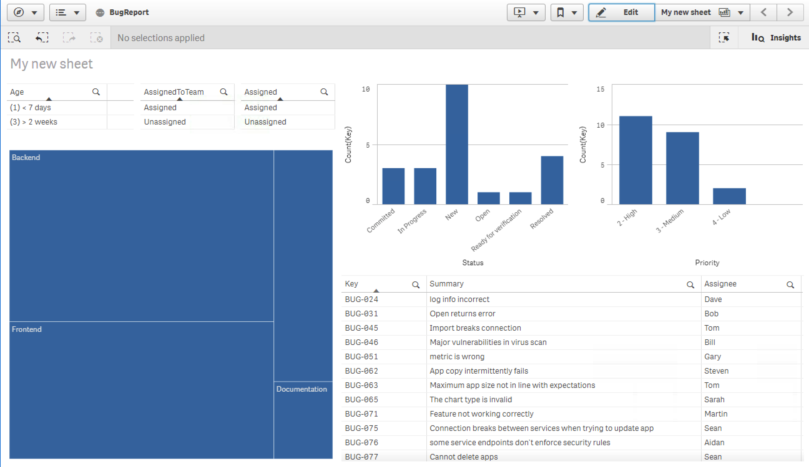

# qlik-rest-connector

A simple REST connector example for Qlik Sense Enterprise.

## Steps to import REST data

##### 1. Create new app and select add data



##### 2. Select REST data source



##### 3. Enter REST URL and connection name
> Set URL to https://raw.githubusercontent.com/jimareed/qlik-rest-connector/master/example.json and enter a connection name.



##### 4. Set Authentication to Anonymous and select Create




##### 5. Select 'data' and then select Add Data to import data



##### 6. Build Qlik Sense app



## Steps to refresh REST data
##### 1. Build and run REST connector
```
$ docker build --tag qlik-rest-connector .
$ docker-compose up
$ docker-compose down (to shutdown connector)
```
